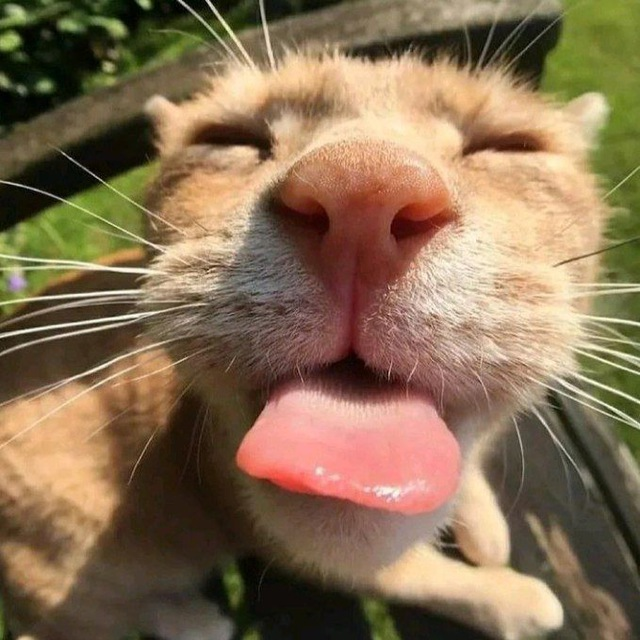

# AvatarMaster 

## Frontend

<div align="center">



**Интерактивный чат-бот с эмоциональным котом-аватаром**

[🌐 Посмотреть рабочую версию (демо с UI-заглушками)](https://avatar-master-iwgmw58z8-xovanskis-projects.vercel.app/)

[](https://nextjs.org/)
[](https://tailwindcss.com/)

</div>

## 🚀 О проекте

AvatarMaster — это интерактивный веб-чат, где пользователь может общаться с AI, представленным в виде очаровательного кота-аватара. Уникальность проекта в том, что аватар реагирует на сообщения пользователя и контекст беседы меняющимися эмоциями (радость, грусть, удивление, злость, влюбленность и другие), создавая живой и immersive опыт общения.

Основной стек: **Next.js 15 (App Router), Tailwind CSS**.

## ✨ Ключевые возможности

- **Динамический аватар**: Кот анимированно реагирует на действия пользователя (печать, отправка сообщения, наведение)
- **Широкий спектр эмоций**: Реализованы состояния `neutral`, `happy`, `sad`, `angry`, `love`, `laughing`, `curious`, `blink`
- **Адаптивный интерфейс**: Полностью адаптирован под мобильные устройства и desktop
- **Локальное хранение**: История чата сохраняется в `localStorage`
- **Интуитивный UI**: Чистый и современный дизайн с плавными анимациями
- **Страница 404**: Кастомная страница с грустным котом

## 🗂 Структура проекта (Архитектура FSD)

Проект следует методологии Feature-Sliced Design (FSD), что обеспечивает его исключительную масштабируемость, поддерживаемость и чистоту кода. Архитектура четко разделяет ответственность между слоями

```bash
src/
├── app/ # Роутинг, layout и страницы Next.js (Слой Pages)
│ ├── layout.js # Корневой layout с провайдерами шрифтов
│ ├── page.js # Главная страница чата
│ ├── not-found.js # Кастомная страница 404
│ └── globals.css # Глобальные стили и анимации
├── entities/ # Бизнес-сущности (Слой Entities)
│ └── chat/
│ ├── model/ # Логика чата: хуки, API, типы
│ │ ├── useChat.js
│ │ └── api.js
│ └── ui/ # UI компоненты, специфичные для сущности Chat
│ ├── Message.js
│ └── Chat.js
├── features/ # Функциональности пользователя (Слой Features)
│ ├── send-message/ # Фича "Отправка сообщения"
│ │ ├── components/
│ │ │ └── SendMessageForm.js
│ │ └── index.js
│ └── avatar-control/ # Фича "Управление аватаром"
│ ├── components/
│ │ └── Avatar.js
│ └── hooks/
│ └── useAvatar.js
├── widgets/ # Композитные компоненты (Слой Widgets)
│ ├── chat-window/ # Виджет окна чата
│ │ └── ChatWindow.js
│ └── avatar-display/ # Виджет отображения аватара
│ └── AvatarDisplay.js
├── shared/ # Переиспользуемый код (Слой Shared)
│ ├── api/ # Инфраструктура API
│ │ └── client.js
│ ├── ui/ # Базовые UI-компоненты (кнопки, инпуты)
│ │ ├── Button.js
│ │ └── Input.js
│ ├── lib/ # Вспомогательные функции (хелперы)
│ │ └── helpers.js
│ └── types
│ └── index.js
└── styles/ # Глобальные стили (альтернатива app/globals.css)
└── globals.css
```

## 🛠 Установка и запуск

1. **Клонируйте репозиторий** (если он есть) или создайте папку для файлов.
```bash
git clone <your-repository-url>
cd avatar-master-frontend
```
2. **Установите зависимости** (убедитесь, что у вас есть package.json с зависимостями).
```bash
npm install
# или
yarn install
# или
pnpm install
```

3. **Настройте переменные окружения:**
Создайте файл .env.local в корне проекта и укажите URL вашего бэкенд-API:
```bash
NEXT_PUBLIC_API_URL="http://localhost:5000" # или URL вашего деплоя
```

4. **Запустите сервер для разработки.**
```bash
npm run dev
# или
yarn dev
# или
pnpm dev
```

5. **Откройте http://localhost:3000 в браузере.**

## 🎨 Эмоции аватара

Аватар реализован как интерактивный SVG, где ключевые элементы (глаза, брови, рот) анимируются через CSS-классы. Каждая эмоция — это комплексная анимация, создающая живой и выразительный образ.

| Эмоция | CSS Класс | Визуальные эффекты | Анимации |
| :--- | :--- | :--- | :--- |
| **Нейтральный** | `neutral` | Стандартное выражение, расслабленные черты | Плавное моргание, легкое дыхание |
| **Счастливый** | `happy` | Широкая улыбка, приподнятые брови | Радостное подпрыгивание, сияние |
| **Грустный** | `sad` | Опущенные уголки рта, печальные брови | Капающие слезы, медленное покачивание головой |
| **Злой** | `angry` | Нахмуренные брови, острые черты лица | Дрожание от ярости, резкие движения |
| **Влюбленный** | `love` | Поднятые бровки, глаза-сердечки | Всплывающие сердечки, пульсирующее свечение |
| **Смеющийся** | `laughing` | Широкая улыбка до ушей, прищуренные глаза | Вибрация от смеха, довольное подрагивание |
| **Любопытный** | `curious` | Широко открытые глаза, наклон головы | Исследующий наклон, внимательный взгляд |
| **Моргание** | `blink` | Быстрое закрытие глаз | Естественная анимация моргания в режиме ожидания |

## 📱 Адаптивность

Проект разработан с использованием **mobile-first подхода** и обеспечивает безупречное отображение на всех типах устройств. Адаптивность реализована через комбинацию Tailwind CSS утилит и кастомных медиа-запросов.

### 🖥️ Брейкпоинты и стратегия адаптации

| Разрешение | Класс устройства | Особенности реализации |
| :--- | :--- | :--- |
| **< 425px** | Mobile S | Компактные интерфейсы, увеличенные тач-зоны, оптимизированные шрифты |
| **425px - 767px** | Mobile L | Улучшенное использование пространства, адаптивные изображения |
| **768px - 1023px** | Tablet | Горизонтальные layout'ы, активация ховер-эффектов |
| **1024px - 1439px** | Laptop | Полноценная desktop-версия, расширенные возможности |
| **1440px+** | Desktop/4K | Максимальное использование пространства, улучшенная графика |

### 🔧 Ключевые адаптивные техники

- **Гибкая сетка:** Проценты и `fr` единицы вместо фиксированных пикселей
- **Респонсивные изображения:** `srcset` и `sizes` для оптимальной загрузки
- **Адаптивная типографика:** `clamp()` функция и относительные единицы (rem, em)
- **Conditional Loading:** Загрузка контента в зависимости от возможностей устройства
- **Touch-friendly UI:** Увеличенные кнопки и адекватные отступы для мобильных устройств

*Интерфейс плавно адаптируется к любому экрану — от компактного смартфона до широкоформатного монитора.*

## Backend

Серверная часть чат-бота-психолога, который поддерживает пользователя в диалоге.  
Бэкенд сочетает **генерацию ответов** и **распознавание эмоций** для более человечного общения.  

---

## ✨ Основные возможности

- Генерация ответов на основе **LLaMA**
- Определение эмоций с помощью кастомной модели на базе **RuBERT** (дообученной в Colab на 8 классов)  
- Поддержка истории диалога (сохраняется последние 6 сообщений)  
- Эвристический fallback для эмоций + запасные ответы при сбое LLM  
- Простое REST API на **Flask** для интеграции с фронтендом или мобильным приложением  

---

## 📂 Архитектура проекта

```bash
backend/
├── app.py # Flask-приложение, маршруты и логика API
├── services/ # Сервисы (LLM и эмоции)
│ ├── init.py
│ ├── emotion_service.py # Классификатор эмоций (HF pipeline + эвристики)
│ └── llm_service.py # Обёртка над llama.cpp
└── utils/
├── init.py
└── text_cleaner.py # Предобработка текста
```

---

## 📥 Загрузка моделей

Так как модели большие, они не хранятся в репозитории (добавлены в `.gitignore`).  
Перед запуском нужно скачать их вручную:

### 🔹 Модель LLaMA
Скачать можно на HuggingFace:  
👉 [saiga_llama3_8b-Q4_K_M-GGUF](https://huggingface.co/itlwas/saiga_llama3_8b-Q4_K_M-GGUF)

После загрузки положите файл по адресу \backend\services\models и в `.env` укажите:

```bash
MODEL_PATH=services/models/saiga_llama3_8b.Q4_K_M.gguf
```

### 🔹Модель эмоций
Скачать можно на drive.google:  
👉 [big_Emotions_model](http://drive.google.com/drive/folders/1qKMtdu7dl_nQjKzpOi5nCBwC7dhMx1m2)

После загрузки положите файл по адресу \backend\services\models

## 🛠 Установка и запуск

1. **Установите зависимости:**
```bash
pip install -r requirements.txt
```
2. **Создайте файл .env в папке backend/**  (если отсутствует, он будет сгенерирован автоматически)
```bash
SECRET_KEY=your-secret-key
MODEL_PATH=../saiga_llama3_8b.Q4_K_M.gguf
```

3. **Запустите сервер:**
```bash
python app.py
```
По умолчанию сервер стартует на:
👉 http://localhost:5000

## 🌐 API эндпоинты
# 🔹 Задать вопрос

POST /ask
Пример запроса:
```bash
{
  "question": "Мне сегодня очень грустно..."
}
```
Пример ответа:
```bash
{
  "answer": "Мне очень жаль, что вы грустите. Хотите рассказать подробнее?",
  "emotion": "sad",
  "response_time": 1.24,
  "history_length": 2
}
```

# 🔹 Очистить историю
POST /clear
```bash
{
  "status": "success",
  "message": "История диалога очищена"
}
```

# 🔹 Получить историю
GET /history
```bash
{
  "history": [
    {"role": "user", "content": "Привет"},
    {"role": "bot", "content": "Здравствуйте! Как вы себя чувствуете?"}
  ],
  "length": 2
}
```
## 🎭 Модель эмоций
Кастомная модель big_Emotions_model, обученная на базе RuBERT, классифицирует 8 эмоций:
*sad, happy, angry, love, curious, surprised, laughing, neutral*

Если модель недоступна, используется fallback-эвристика (ключевые слова).